# Zero-Touch Fulfillment with Confluent Cloud

**Use case:** picture an online storefront. Orders land constantly, and fulfillment wants two things live: automatically **route** each order to a warehouse that actually has the stock (a **join**), and **auto-approve** the safe ones straight to pick/pack while routing risky or out-of-stock orders to a human (a **decision gate**). This is how I built exactly that — entirely inside Confluent Cloud.

**Why it matters:** the goal is a high *zero-touch rate* — most orders go from click to warehouse dispatch with no human in the loop at all. Only the genuine exceptions (no stock anywhere, or a risky order) need a person, so fulfillment scales with the exception rate, not with total order volume.


## Stream Lineage
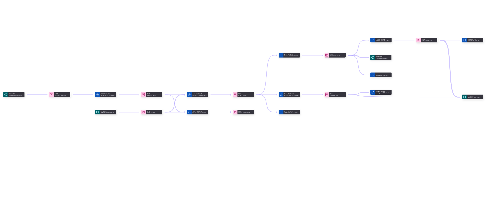

---

## 1. Creating a Cluster

1. I went to the **Environments** page and opened the `default` environment that came with my account.

   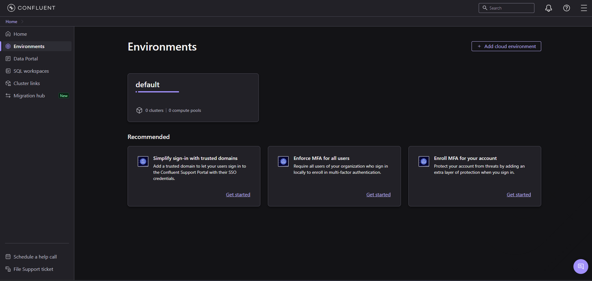
2. From there I opened **Clusters** in the left nav and clicked **Add new cluster**.

   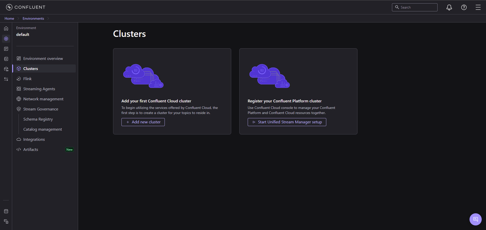
3. On the **Create cluster** page I left the defaults as they were — **Standard** cluster, **AWS**, region **us-east-2** — and clicked **Continue**.

   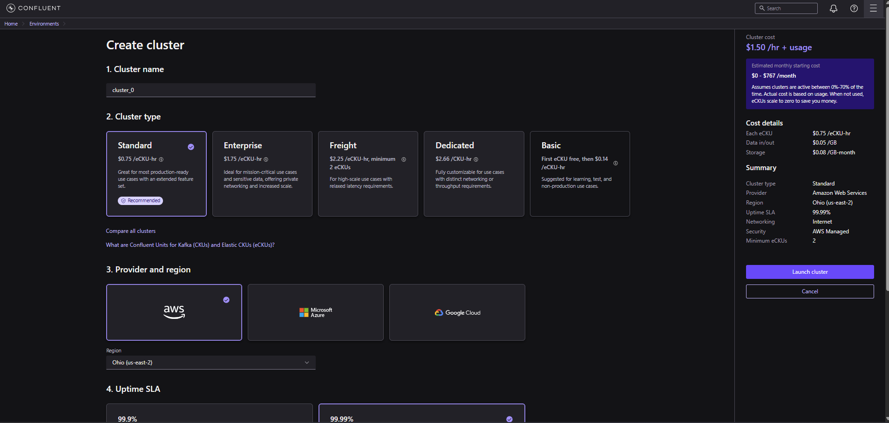
4. I clicked **Launch cluster** and waited for it to show **Running**.

   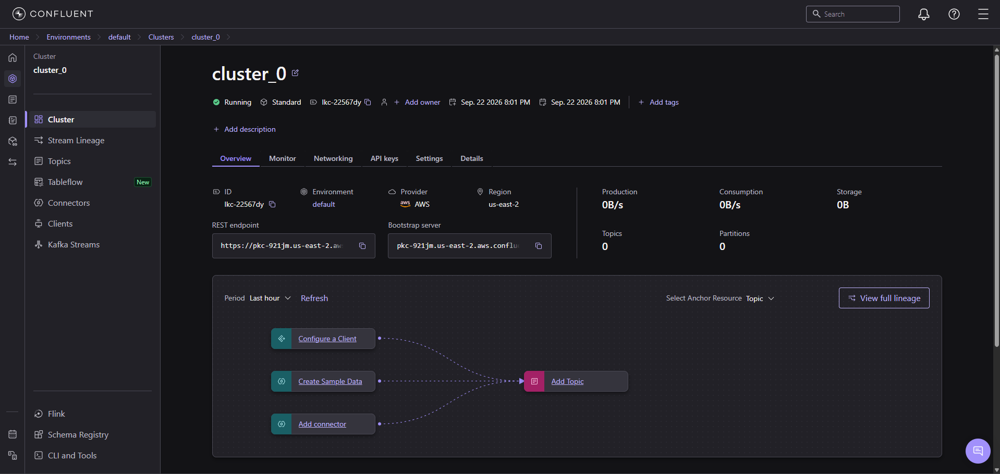

---

## 2. Generating Data Sources

I stood up two **Sample Data** (Datagen Source) connectors using custom schemas (see `SCHEMAS-zero-touch-fulfillment.md`): **`orders_placed`** (incoming orders — `order_id`, `sku`, `qty`, `order_value`, `account_age_days`, ...) and **`inventory_snapshot`** (warehouse stock — `warehouse_id`, `sku`, `qty_on_hand`, `zip`). I drew `sku` from the same 5-value pool in both so orders would actually match stock.

1. From the cluster I opened **Connectors**.

   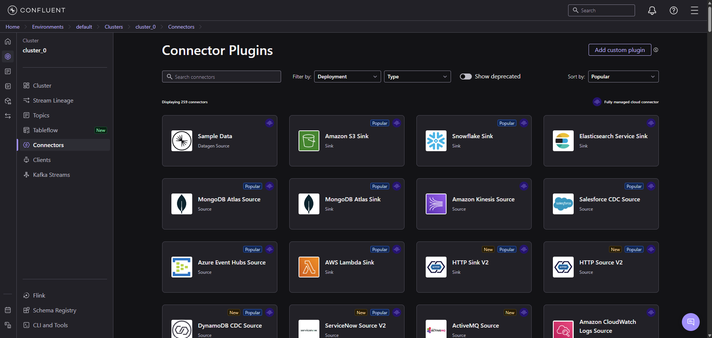
2. I picked the **Datagen Source** connector.

   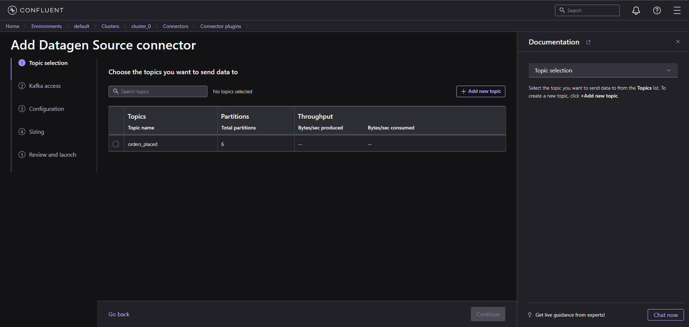
3. I set the output topic to `orders_placed`, switched the schema to **Custom**, and pasted in the `orders_placed` Avro Random Generator schema from `SCHEMAS-zero-touch-fulfillment.md`. I set `order_id` as the record key and clicked **Launch**.

   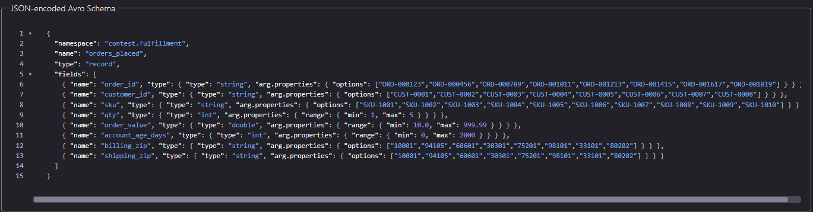
   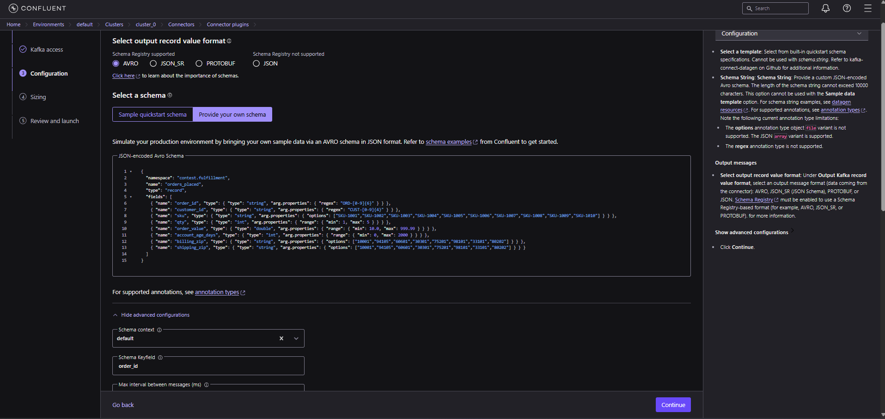
4. I added a second Datagen connector the same way — output topic `inventory_snapshot`, custom schema pasted from the same file, `sku` as the record key — and launched it too.

   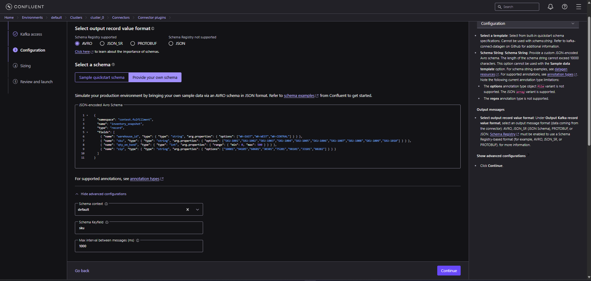
5. I waited until both connectors showed **Running**.

   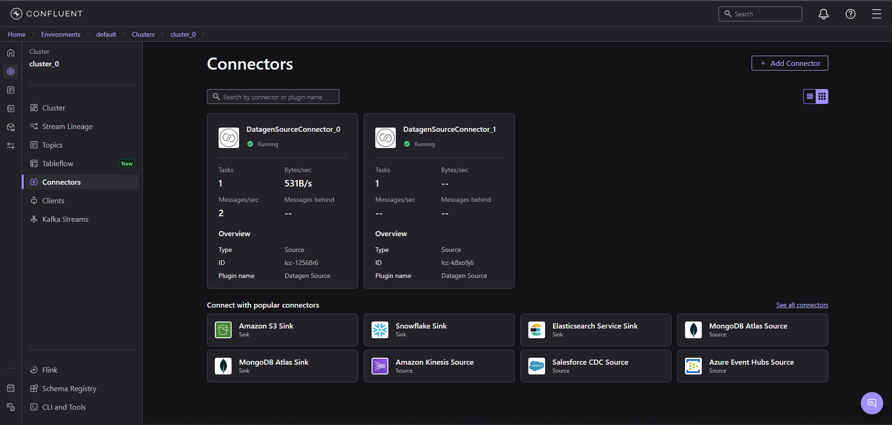
6. Then I opened **Topics**, clicked into `orders_placed`, and checked the **Messages** tab to watch live orders come in.

   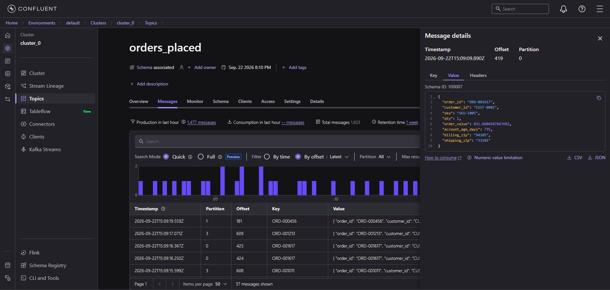
7. I did the same for `inventory_snapshot` and confirmed the `sku` field lined up with what I'd seen in `orders_placed`.

   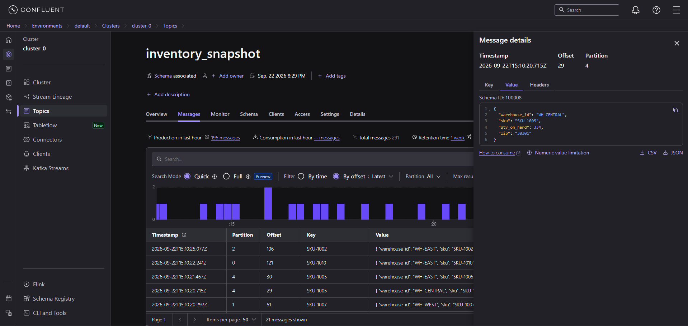

---

## Routing & Auto-Approving Orders with Flink

With orders and inventory now streaming, I used Flink SQL to answer the two fulfillment questions: **which warehouse can fill this order** (routing), and **is this order safe to auto-approve, or does it need a human** (the zero-touch gate) — both computed continuously on the live streams.

### Step 1: Setting Up a Compute Pool

1. I opened Flink, selected the **default** environment, and clicked **Continue**.

   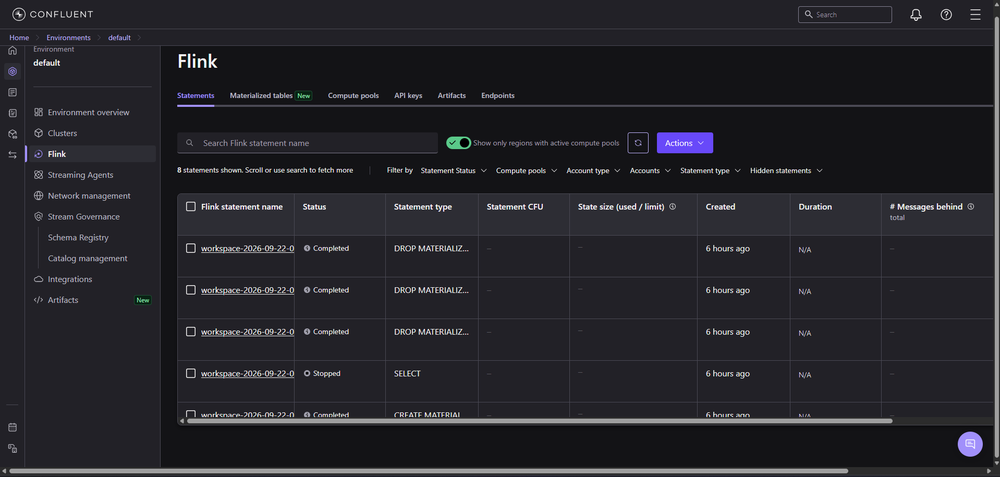
2. On the **Compute pools** tab I clicked the default compute pool that was availble.

   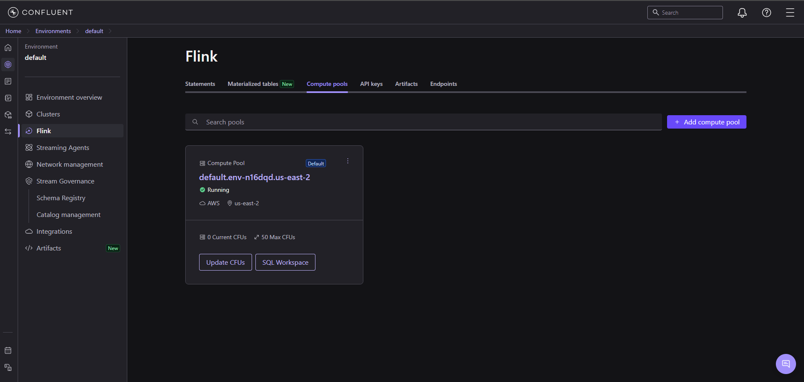
3. Then I clicked **Open SQL Workspace** to open a query editor, then set **Use catalog** to `default` and **Use database** to my cluster (`cluster_0`).

   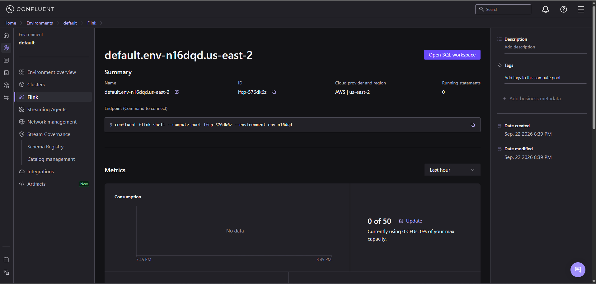
   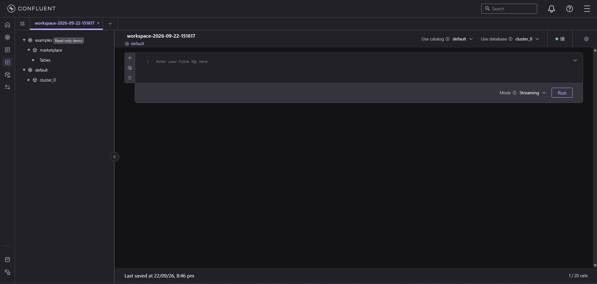

### Step 2: Routing Orders to a Warehouse

1. `inventory_snapshot` is append-only, so first I keyed it into a "current stock per SKU" lookup table using a materialized table:

   ```sql
   CREATE MATERIALIZED TABLE inventory_keyed (
     sku STRING NOT NULL,
     warehouse_id STRING,
     qty_on_hand INT,
     zip STRING,
     PRIMARY KEY (sku) NOT ENFORCED
   ) AS
   SELECT sku, warehouse_id, qty_on_hand, zip FROM inventory_snapshot;
   ```

2. Then I routed each order to a warehouse with enough stock, using a temporal join:

   ```sql
   CREATE MATERIALIZED TABLE orders_routed AS
   SELECT
     o.order_id, o.customer_id, o.sku, o.qty, o.order_value, o.account_age_days,
     i.warehouse_id, i.qty_on_hand
   FROM orders_placed o
   JOIN inventory_keyed FOR SYSTEM_TIME AS OF o.`$rowtime` AS i
     ON o.sku = i.sku
   WHERE i.qty_on_hand >= o.qty;
   ```

3. I also wanted the exception path, so I captured orders with no matching stock anywhere:

   ```sql
   CREATE MATERIALIZED TABLE orders_backordered AS
   SELECT o.order_id, o.sku, o.qty
   FROM orders_placed o
   LEFT JOIN inventory_keyed FOR SYSTEM_TIME AS OF o.`$rowtime` AS i
     ON o.sku = i.sku
   WHERE i.sku IS NULL OR i.qty_on_hand < o.qty;
   ```

4. I queried `orders_routed` to confirm routed orders were carrying a warehouse assignment:

   ```sql
   SELECT * FROM orders_routed;
   ```

   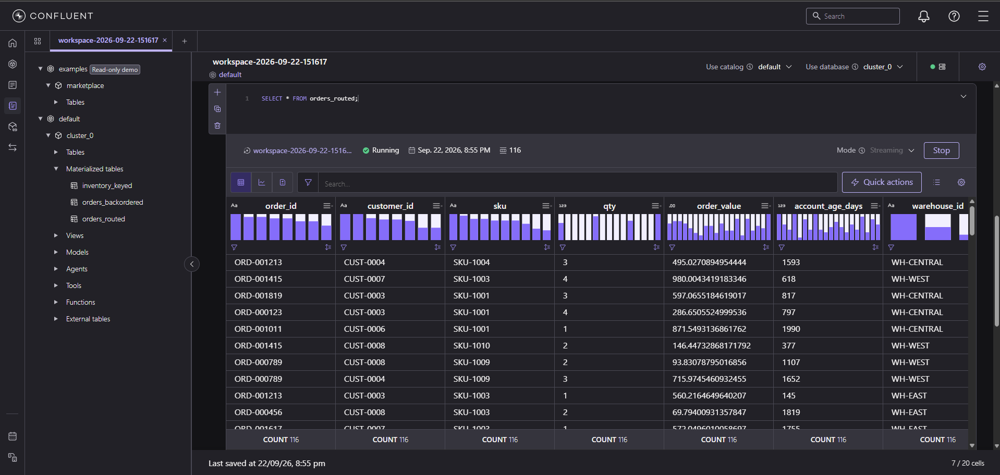

### Step 3: Building the Zero-Touch Approval Gate

Next I split `orders_routed` into the auto-approved path and the human-review exception: a high-value order from a new account needs a person to look at it, everything else is zero-touch.

```sql
CREATE MATERIALIZED TABLE orders_approved AS
SELECT order_id, customer_id, warehouse_id, order_value
FROM orders_routed
WHERE NOT (order_value > 500 AND account_age_days < 30);

CREATE MATERIALIZED TABLE orders_review AS
SELECT order_id, customer_id, warehouse_id, order_value,
  'high_value_new_account' AS reason
FROM orders_routed
WHERE order_value > 500 AND account_age_days < 30;
```

I queried both tables to see the split play out:

```sql
SELECT * FROM orders_approved;
```

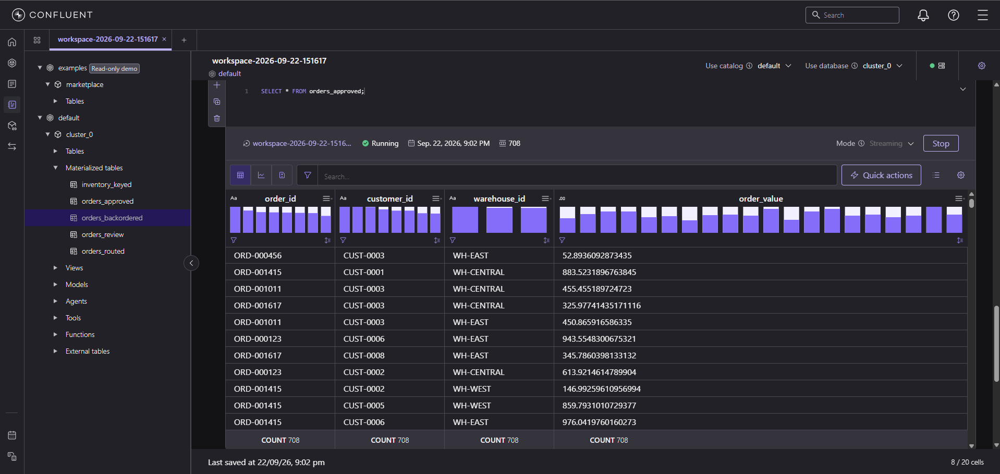

```sql
SELECT * FROM orders_review;
```

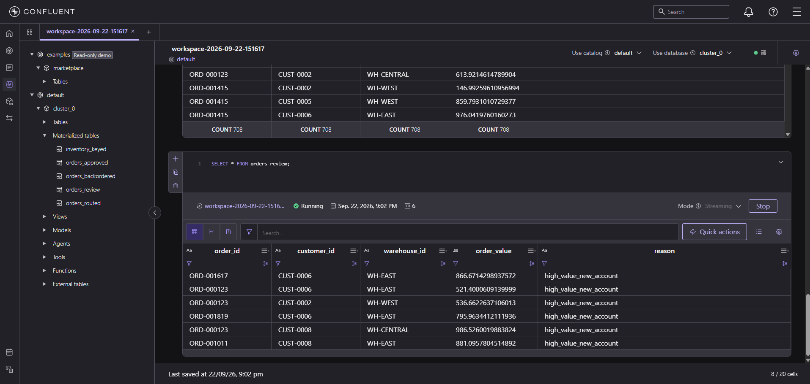


Next I created another materialized table to send all order alerts to Slack channel (atleast that was the plan)

```sql
SELECT * FROM orders_slack_alert;
```

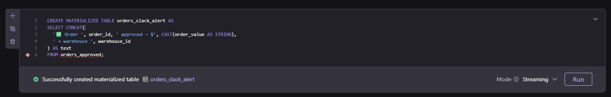

> [!NOTE]
> **This is the zero-touch story.** `orders_approved` is the automated path — nothing left to do but notify the warehouse and the customer. `orders_review` and `orders_backordered` are the only two places a human ever gets involved.

### Step 4: Notifying the Warehouse & Customer

1. I opened **Connectors** → **Add Connector** → **HTTP Sink**, pointed it at `orders_approved`, set the **HTTP URL** to a webhook (I tried to use a Slack incoming webhook but was facing some issues with Slack so instead I used [webhook.site](https://webhook.site/)), and clicked **Launch** — this simulates the "create pick ticket" call to a warehouse system.

   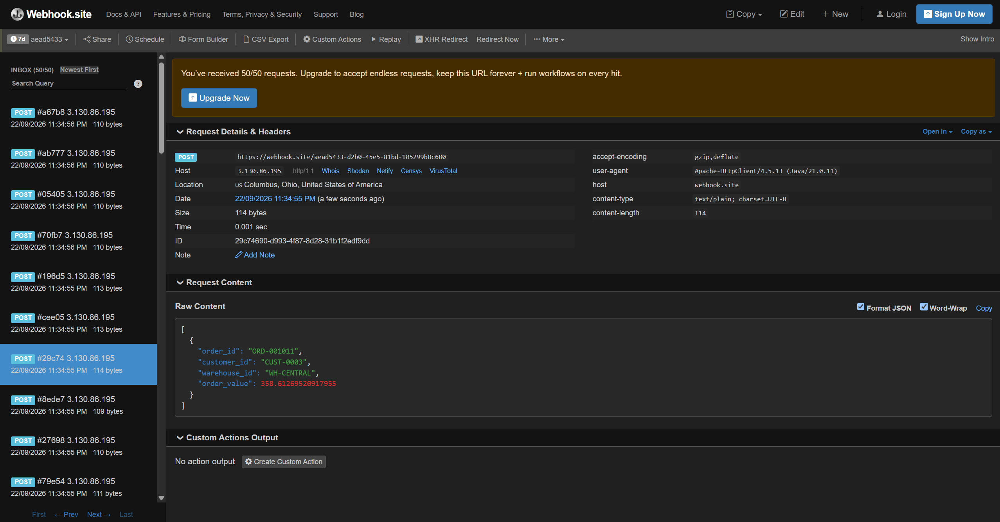
2. I added a second HTTP Sink connector, on `order_review`, pointed at a different webhook to human-review if its a high value order.

   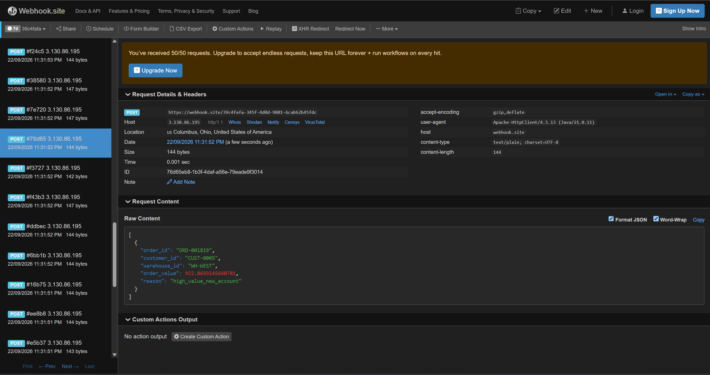
3. Then I watched both connectors fire in near real time as new orders auto-approved.

   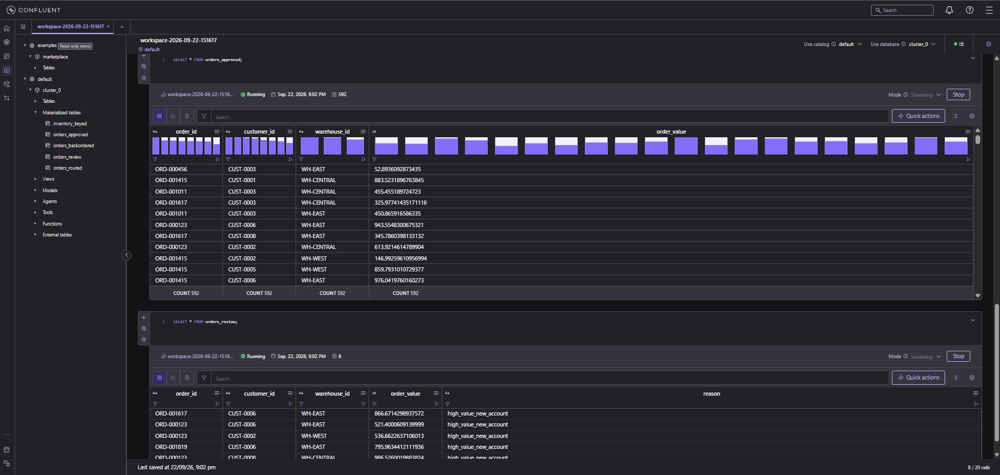

---

## Cleaning Up

I dropped the materialized afterward so nothing kept running.

1. In the SQL workspace I dropped the Flink materialized tables, in dependency order:

   ```sql
   DROP MATERIALIZED TABLE orders_review;
   DROP MATERIALIZED TABLE orders_approved;
   DROP MATERIALIZED TABLE orders_backordered;
   DROP MATERIALIZED TABLE orders_routed;
   DROP MATERIALIZED TABLE inventory_keyed;
   DROP MATERIALIZED TABLE orders_slack_alert;
   ```
2. Then I deleted the two **HTTP Sink** connectors and two **Datagen Source** connectors from **Connectors**.
3. Finally I deleted the **cluster** (Cluster → Settings → Delete cluster), which took the remaining topics with it.

